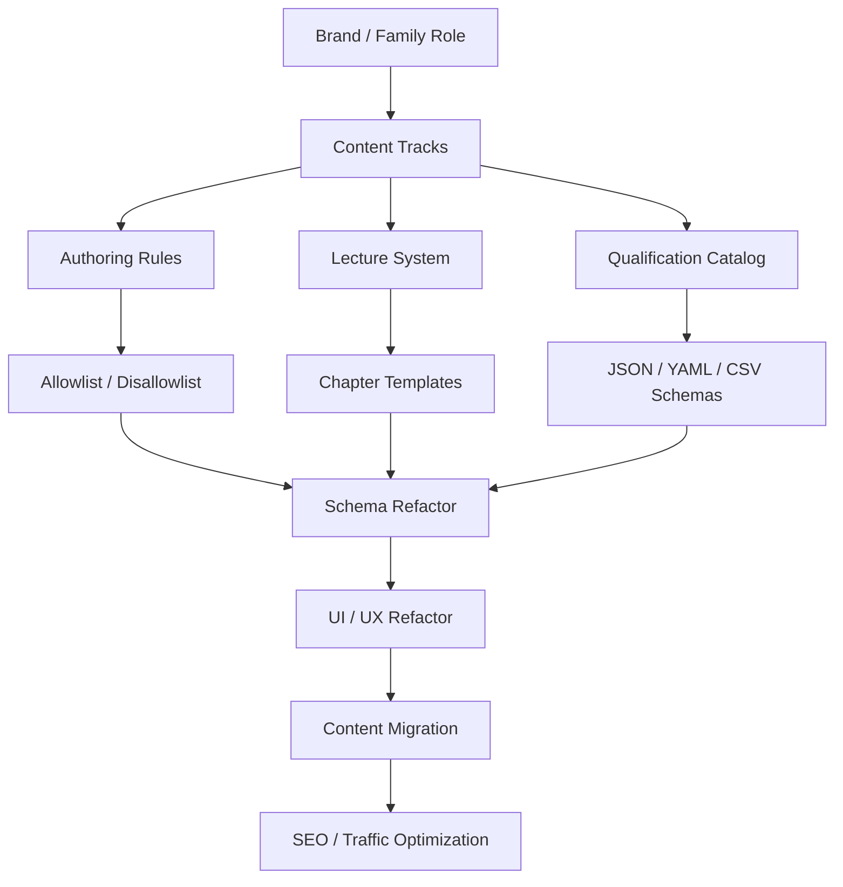

# Execution Roadmap

## 1. Purpose

This document turns the newly defined strategy into a phased execution plan.

The current stage is:

1. concept definition
2. rule writing
3. structure planning
4. data-model planning

The current stage is not yet large-scale implementation. We are still in the `conceptualize -> concretize` process.

## 2. Planning Flow

## 3. Phase Overview

### Phase 1 — Strategy Definition

Goal:

1. lock project boundaries
2. lock content tracks
3. lock writing direction
4. lock image-light policy
5. lock lecture and catalog philosophy

Deliverables:

1. cross-project `BRAND.md`
2. content charter
3. MDOC authoring spec
4. lecture system blueprint
5. credential catalog blueprint
6. content inventory blueprint

Completion signal:

The team can explain what each project is for, what each content track means, and what kind of content is allowed before writing any new page.

### Phase 2 — Standard and Schema Definition

Goal:

1. define content fields before building more pages
2. define what the renderer is allowed to process
3. define how lecture and qualification data should be stored

Deliverables:

1. content schema draft
2. track taxonomy draft
3. component allowlist
4. component disallowlist
5. qualification schema templates
6. master content inventory template

Planned implementation targets:

1. `src/content/config.ts`
2. `src/lib/taxonomy.ts`
3. `data/catalog/*`
4. future `docs/component-allowlist.md`
5. future `docs/component-disallowlist.md`

Completion signal:

New content can be described in metadata and inventory form before article body drafting starts.

### Phase 3 — Information Architecture Refactor

Goal:

1. reflect the new strategy in actual route and taxonomy design
2. separate content identity from display state
3. prepare `interactive` as a real first-class track

Deliverables:

1. track-aware routing plan
2. updated category model
3. series model for lectures
4. source-project tagging
5. migration map from `ahoxy-nextjs`

Planned implementation targets:

1. `src/pages/[...lang]/magazine.astro`
2. `src/pages/[...lang]/courses.astro`
3. future `src/pages/[...lang]/interactive.astro`
4. category pages
5. search behavior

Completion signal:

The site map can cleanly distinguish `academy`, `magazine`, and `interactive` without ambiguity.

### Phase 4 — Authoring Surface Cleanup

Goal:

1. reduce uncontrolled MDX surface area
2. stabilize emphasis and rendering behavior
3. prevent literal markdown leakage

Deliverables:

1. MDOC migration rules
2. stricter emphasis rules
3. formula policy
4. table policy
5. future lint checklist for content files

Planned implementation targets:

1. `astro.config.mjs`
2. `src/pages/[...lang]/[...slug].astro`
3. `src/styles/global.css`
4. `src/components/mdx/*`

Completion signal:

Writers know exactly when to use `**bold**`, `<mark>`, formulas, tables, and allowed custom blocks.

### Phase 5 — Lecture System Structuring

Goal:

1. pre-plan lecture series before expansion
2. standardize chapter naming
3. standardize classroom-friendly chapter composition

Deliverables:

1. lecture series registry
2. chapter templates
3. teaching schedule template
4. formal numbering rules for public-document content

Priority lecture families:

1. management
2. economics
3. NCS
4. public document writing
5. labor law
6. tax law
7. qualification overviews linked to subject lectures

Completion signal:

Every new lecture can be placed into a known series with a planned chapter arc.

### Phase 6 — Qualification Catalog Buildout

Goal:

1. create structured knowledge assets for many professional qualifications
2. connect qualification overviews to actual lecture series

Deliverables:

1. normalized qualification records
2. qualification comparison tables
3. exam-stage subject maps
4. linked lecture requirements

Priority content families:

1. 공인노무사
2. 세무사
3. 감정평가사
4. 법무사
5. 변리사
6. 변호사
7. 공인회계사
8. 경영지도사
9. 행정사
10. technical and medical licenses after core legal/business ones

Completion signal:

The platform can generate overview pages, comparison pages, and lecture linkage from structured records.

### Phase 7 — UI / UX Refactor

Goal:

1. remove slow browsing patterns
2. make discovery faster
3. make image-light cards still feel complete

Deliverables:

1. track tabs
2. filter chips
3. series cards
4. chapter lists
5. text-first cards
6. interactive browsing page

Priority UX problems to solve:

1. long horizontal browsing
2. weak lecture series overview
3. image dependence
4. mixed-purpose page layouts

Completion signal:

A user can quickly reach the desired lecture, magazine topic, or interactive page with fewer scanning steps.

### Phase 8 — Migration, SEO, and Governance

Goal:

1. migrate strong Ahoxy assets into richer content experiences
2. improve cross-site traffic flow
3. keep the system clean as it grows

Deliverables:

1. Ahoxy migration list
2. interactive editorial templates
3. internal-link rules
4. GA4 review checklist
5. recurring content/data/component audit checklist

Completion signal:

Traffic strategy, data structure, and content production work together instead of drifting apart.

## 4. Standards Checklist

### 4.1 Structural Standards

1. every content item has a track
2. every lecture item has a series and chapter rule
3. every qualification record exists outside prose
4. every migrated Ahoxy candidate has a source tag

### 4.2 Authoring Standards

1. markdown first
2. limited raw HTML
3. controlled emphasis
4. controlled component usage
5. no arbitrary JSX growth

### 4.3 Style Standards

1. lecture titles stay short
2. formal numbering follows the 2025 administrative handbook pattern
3. image creation is not assumed
4. tables/charts/formulas must match the actual lesson need

### 4.4 Platform Standards

1. Cloudflare Pages first
2. static-first architecture
3. client JS only when justified
4. simple inspectable data formats

## 5. Technical Direction

### 5.1 Current Core Stack

1. Astro
2. Tailwind CSS
3. Astro content collections
4. React islands
5. Cloudflare adapter
6. remark/rehype markdown pipeline
7. KaTeX for math

### 5.2 Directional Rule

Keep the stack stable. Reduce incidental complexity before adding new layers.

### 5.3 Preferred Composition Rule

1. markdown or future MDOC for prose
2. content collections for metadata
3. structured data files for catalogs
4. React islands only where interaction adds real value
5. shadcn-style primitives for UI consistency

## 6. Content Planning List

### 6.1 Academy Priority List

1. 경영학 core series
2. 경제학 core series
3. 공무원 문서작성법 series
4. NCS core series
5. 노동법 entry series
6. 세법학 entry series
7. 재정학 entry series

Immediate detail expansion targets:

1. NCS `자기개발능력`
2. NCS `대인관계능력`
3. NCS `기술능력`
4. NCS `조직이해능력`
5. NCS `직업윤리`
6. 세법 `국가징수법`
7. 세법 `종합부동산세`
8. 세법 `양도소득세`
9. 세법 `상속세`
10. 세법 `증여세`

### 6.2 Magazine Priority List

1. 공부 잘하는 방법론
2. 내가 뭘 좋아하는지 알아가는 방법
3. 맥 제품 수명, 구매 타이밍, 중고가 판단
4. 투자 및 주식 입문
5. 전문자격증 준비 전략 총론

### 6.3 Interactive Priority List

1. 오목의 유래와 두는 법 + `Gomoku`
2. 체스 전략 사고 + `ChessBoard`
3. 미니 계산기 삽입형 금융/세무 글
4. 논리학 글 + 진리표/논리 도구
5. 공부법 글 + 간단한 학습 지원 island

## 7. Next Concrete Documents to Add

The following documents should be added next if we continue planning before coding.

1. `docs/interactive-migration-map.md`
2. `docs/content-style-examples.md`
3. `docs/content-schema-draft.md`
4. `docs/category-and-track-map.md`
5. `docs/internal-linking-playbook.md`
6. `docs/ga4-review-checklist.md`

## 8. Practical Next Move

The best next move after this document phase is:

1. finalize the content schema fields
2. define the component allowlist in concrete names
3. draft the first lecture series registry
4. draft the first 20 qualification records in structured form

That is the point where planning remains precise but starts becoming directly implementation-ready.
