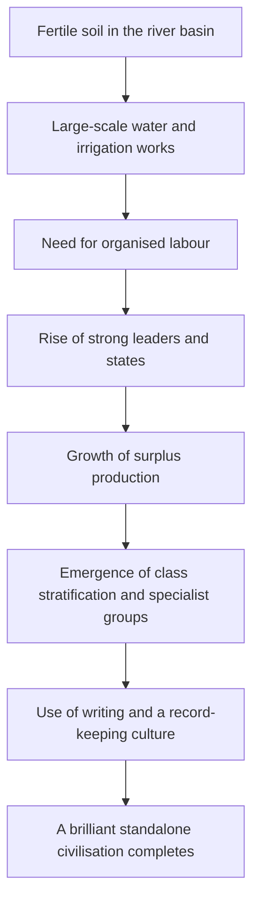

# History of Everywhere - From Prehistory to Civilization

History is not a single line but an entanglement of countless lines occurring simultaneously across the globe. What was happening on the other side of the world at the same time?

---

## 1. Comparative Timeline: Stone Age (East vs. West)

Let's look at the flow from tool usage in the Paleolithic to the start of settled life in the Neolithic Revolution.

| Period (Approx)        | West / Near East                | East Asia                                             | Key Significance                           |
| :--------------------- | :------------------------------ | :---------------------------------------------------- | :----------------------------------------- |
| **Before 10,000 B.C.** | Lascaux Cave paintings (Europe) | Peking Man (China), Jeongok-ri (Korea)                 | Paleolithic: Chipped stone tools           |
| **10k - 8k B.C.**      | Farming in Fertile Crescent     | Jomon Pottery appear (Japan)                          | Neolithic Revolution: Birth of Agriculture |
| **6k - 4k B.C.**       | Painted Pottery (Mesopotamia)   | Yangshao Culture (Yellow River), Comb-pattern (Korea) | Settled life and village formation         |

---

## 2. The Four Major Civilizations (3500 - 2500 B.C.)

Human civilizations emerged near large river basins, either simultaneously or with slight time gaps.

1.  **Mesopotamia**: Tigris & Euphrates Rivers. <mark>Cuneiform</mark>, development of city-states.
2.  **Egyptian**: Nile River. <mark>Hieroglyphics</mark>, Pyramids, belief in the afterlife.
3.  **Indus**: Indus River. Harappa & Mohenjo-daro, planned cities.
4.  **Yellow River**: Yellow River. Oracle bone script, foundations of <mark>Feudalism</mark>.

| Civilisation | Central River | Signature Legacy | Characteristic Worldview |
| :----------- | :------------ | :--------------- | :----------------------- |
| **Mesopotamia** | Tigris & Euphrates | **Cuneiform**, the zodiac | Present-centred and pessimistic (frequent floods) |
| **Egypt** | Nile | **Hieroglyphs**, pyramids | **Belief in the afterlife**, immortality (the Nile's regularity) |
| **Indus** | Indus | Planned cities (Mohenjo-daro) | Sophisticated drainage, bath culture |
| **Yellow River** | Yellow River | **Oracle bone script**, Yin and Yang | Ancestor veneration, the fusion of politics and religion |

### a. 🔄 The Mechanism of Civilisation Rise

---

## 3. Common Features of Civilizations

- **River Basins**: Access to fertile soil and water for irrigation.
- **Social Hierarchy**: Emergence of surplus agriculture and private property.
- **Use of Writing**: Need for records for governance and taxation.
- **Bronze Age**: Development of tools and the start of organized warfare.

---

## 4. A Closer Look: The Power of Writing

Writing was not merely a means of keeping records. It was a **tool of governance** — used to collect taxes, promulgate law, and carry a ruler's authority across distances. From the moment humans took up writing, pre-history ended and the era of <mark><strong>history</strong></mark> began.

---

## 5. Closing: We Are All Contemporaries

We have just walked from the birth of humanity to the rise of civilisation. Geographically these early peoples were far apart, but they alike faced the same problems — survival, food, order — and each produced its own answer along its own river.

From here we will watch those answers collide, accommodate each other, and weave the great web of a single world.

---

## Key Checklist

- [ ] What is the term for the massive shift from a hunter-gatherer economy to a production-based agricultural economy? (Answer: Neolithic Revolution)
- [ ] What was the name of the script used on clay tablets in Mesopotamia? (Answer: Cuneiform)
- [ ] What geographical feature do the four major civilizations share in common? (Answer: Large river basins)

---

## 📖 References

The great works that shaped how we understand the macro currents of human history.

- **[Guns, Germs, and Steel] — Jared Diamond**: A classic of civilisation history answering why the West came to dominate the world, through geographic and environmental determinism.
- **[Sapiens] — Yuval Noah Harari**: Analyses how an unremarkable ape from the backwater of the Levant came to rule the planet, through the distinctive lens of 'shared fictions'.
- **[The Creators] — Daniel Boorstin**: A sweeping history focused on the great discoveries, inventions, and the human creative instinct that changed the course of history.

---

Thank you for reading. Next time we look at how these early civilisations grew into empires, completing distinct political systems in the East and the West — the **formation of ancient empires and the birth of religion**.
