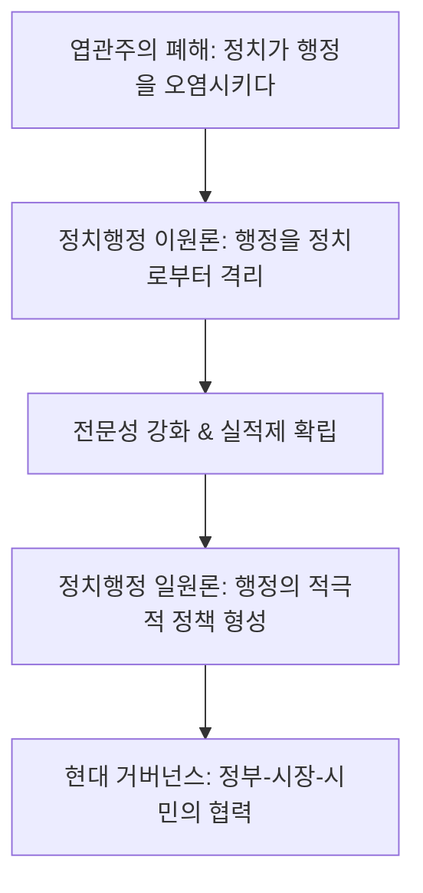

import Callout from "@/components/mdx/Callout.astro";

# Chapter 1. 공공의 수호자: 행정학의 기초와 거버넌스의 태동

학우 여러분, 반갑습니다. '교수님'과 함께하는 **행정학(Public Administration)**의 여정에 오신 것을 진심으로 환영합니다. 여러분은 '행정'이라는 말을 들으면 무엇이 떠오르나요? 동사무소의 친절한 공무원? 아니면 복잡한 서류 절차?

제가 생각하는 행정학은 <mark><strong>"공동체의 문제를 해결하는 거대한 집단적 지성"</strong></mark>입니다. 우리가 매일 누리는 치안, 교육, 복지, 그리고 깨끗한 물과 공기 뒤에는 행정이라는 치밀한 운영 시스템이 작동하고 있습니다. 오늘 우리는 행정이 단순히 법을 집행하는 것을 넘어, 어떻게 우리 사회의 공적 가치를 지탱하고 진화해 왔는지 그 기초를 다져보겠습니다.

---

## 1. 행정의 본질: 무엇을 위해 움직이는가?

행정은 인류의 역사와 궤를 같이합니다. 국가라는 조직이 생긴 이래, 공공의 목적을 달성하기 위한 활동은 늘 존재했죠.

### (1) 행정의 두 얼굴: 공익성과 효율성

행정은 태생적으로 두 가지 숙명을 가집니다.

- **공익성(Public Interest)**: "누구에게나 공평한 사회를 만드는가?"
- **효율성(Efficiency)**: "국민의 세금을 아껴서 최상의 결과를 내는가?"

<mark><strong>"경영이 이윤이라는 나침반을 따른다면, 행정은 공익이라는 북극성을 따릅니다."</strong></mark> 때로는 이 효율성과 공익성이 충돌할 때, 그 합리적인 접점을 찾는 것이 행정학의 가장 고차원적인 고민입니다.

---

## 2. 행정학의 성격: 과학인가 예술인가?

행정학은 한 발은 '원인과 결과의 과학'에, 다른 한 발은 '문제 해결의 기술'에 담그고 있습니다.

### 📊 행정학의 양면성 비교

| 구분          | 과학성 (Science)          | 기술성 (Art / Technique)       |
| :------------ | :------------------------ | :----------------------------- |
| **핵심 가치** | 사실(Fact), 객관성        | 가치(Value), 규범, 실천        |
| **목표**      | 사회적 법칙의 발견과 설명 | 당면한 사회 문제의 처방과 해결 |
| **대표 학자** | 허버트 사이먼 (행태론)    | 드와이트 왈도 (신행정학)       |
| **성격**      | 가치 중립적               | **가치 함축적**                |

<Callout type="note">
  **전문가의 통찰**: 행태론자 사이먼은 행정이 객관적인 사실에 근거해야 한다고 보았습니다. 반면
  왈도를 비롯한 신행정학자들은 1960년대 미국의 극심한 사회 문제를 보며 **<mark>"행정은 격동하는 현장의
  문제를 해결하는 따뜻한 기술이 되어야 한다"</mark>**고 목소리를 높였습니다.
</Callout>

---

## 3. 정치와 행정의 경계: 한 몸인가, 남남인가?

행정은 정치가 결정한 것을 집행만 하면 될까요, 아니면 직접 결정을 내려야 할까요?

### 🔄 정치-행정 관계의 변천사

현대의 행정은 단순히 정해진 법을 지키는 존재가 아닙니다. 갈등을 조정하고 정책의 대안을 제시하는 <mark><strong>"적극적 가치 창출자"</strong></mark>로서의 면모가 더욱 강해지고 있습니다.

---

## 4. 행정과 경영: 닮았지만 근본이 다른 형제

행정은 효율성을 높이기 위해 '경영'의 기법을 자주 빌려옵니다. (신공공관리론, NPM)

- **공통점**: 목표 달성을 위한 조직 관리, 자원 배분의 효율성 추구, 관료제적 성격.
- **차이점**: 경영은 돈을 낸 사람(고객)에게 집중하지만, 행정은 <mark><strong>"사회적 약자를 포함한 모든 국민"</strong></mark>을 고객으로 삼습니다. 또한 행정은 법적 규제가 훨씬 엄격하며, 권력적 수단을 사용할 수 있는 독점적 지위를 가집니다.

---

## 5. 결론: 행정은 신뢰를 짓는 과정입니다

오늘 우리는 행정의 기본 개념과 학문적 성격을 훑어보았습니다. 행정학을 공부한다는 것은 우리가 발을 딛고 사는 공동체의 원칙을 배우는 것입니다.

<mark><strong>"행정의 가치는 보이지 않는 곳에서 증명됩니다."</strong></mark> 사고가 나지 않을 때, 공기가 맑을 때, 가난한 이들이 절망하지 않을 때 행정은 제 역할을 다하고 있는 것입니다. 여러분이 이 학문을 통해 더 나은 세상을 만드는 설계자가 되길 바랍니다.

---

## 📖 참고문헌
행정의 본질과 국가의 역할을 성찰하게 하는 명저들입니다.

- **[국가는 왜 실패하는가 (Why Nations Fail)] - 대런 애쓰모글루**: 왜 어떤 나라는 번영하고 어떤 나라는 빈곤한지, 정치와 행정 제도의 결정적 차이를 날카롭게 분석합니다.
- **[행정의 본질 (The Enterprise of Public Administration)] - 드와이트 왈도**: 현대 행정학의 거장 왈도가 행정이 민주주의와 어떤 관계를 맺어야 하는지 철학적으로 고찰한 책입니다.
- **[국가란 무엇인가] - 유시민**: 고대 그리스부터 현대까지, 역사 속 거장들이 생각한 '좋은 국가'와 '바른 행정'의 정의를 친절하게 해설합니다.

---

수고하셨습니다. 다음 시간은 행정학의 역동적인 역사를 따라가는 시간, **행정 이론의 변천: 관료제에서 뉴거버넌스까지**에 대해 본격적으로 학습해 보겠습니다.
