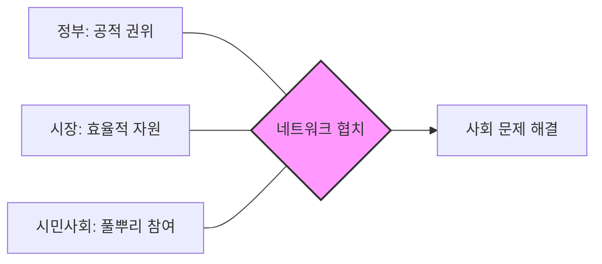

import Callout from "@/components/mdx/Callout.astro";

# Chapter 2. 행정의 패러다임 시프트: 효율의 시장에서 협력의 네트워크로

학우 여러분, 반갑습니다. 지난 시간 우리는 행정의 기초 체력을 길렀습니다. 오늘은 행정이 시대의 변화에 따라 어떻게 그 옷을 갈아입어 왔는지, 즉 **현대 행정 이론의 변천**을 살펴보겠습니다.

세상은 끊임없이 변합니다. 19세기의 밤새 관념(야경국가)이 20세기의 거대 공룡(행정국가)이 되었고, 다시 21세기에는 <mark><strong>"똑똑하고 유연한 네트워크"</strong></mark>로 진화하고 있습니다. "정부도 기업처럼 운영해야 하는가?", "시민은 고객인가, 아니면 주인인가?" 이 질문들에 대한 현대 행정학의 치열한 응답들을 지금부터 하나씩 파헤쳐 보겠습니다.

---

## 1. 작고 효율적인 정부: 신공공관리론 (NPM)

1980년대, 오일 쇼크와 경기 침체로 비대해진 정부에 대한 비판이 쏟아졌습니다. 이때 등장한 것이 바로 **신공공관리론(New Public Management)**입니다.

- **슬로건**: "정부는 노 젓기(집행)보다는 방향 잡기(기획)에 집중하라."
- **핵심 전략**:
  - **시장 기제 도입**: 정부 내부에 경쟁을 시키고, 안 되는 사업은 민간에 넘겨라(민영화).
  - **성과 중심**: 과정보다는 결과(산출)로 평가하라.
  - **고객 지향**: 국민을 왕처럼 모시는 '고객'으로 대우하라.

---

## 2. 함께 만드는 사회: 뉴거버넌스 (New Governance)

NPM이 시장의 '경쟁'을 믿었다면, 뉴거버넌스는 우리 사회의 '협력'과 '신뢰'를 믿습니다. 이제 정부 혼자서, 혹은 시장의 힘만으로는 복잡한 사회 문제를 해결할 수 없다는 깨달음에서 시작되었습니다.

### 🔄 거버넌스의 협업 매커니즘

### 📊 NPM vs 뉴거버넌스: 한눈에 비교하기

| 구분            | 신공공관리론 (NPM)     | 뉴거버넌스 (New Governance) |
| :-------------- | :--------------------- | :-------------------------- |
| **운영 기제**   | **경쟁** (Competition) | **협력/신뢰** (Trust)       |
| **관리 수단**   | 시장 (Market)          | 네트워크 (Network)          |
| **시민의 지위** | 고객 (Customer)        | **동반자** (Partner)        |
| **추구 가치**   | 효율성, 결과           | 민주성, 투명성, 책임성      |

---

## 3. 봉사가 정부의 본질이다: 신공공서비스론 (NPS)

데나르트(Denhardt) 부부는 외쳤습니다. <mark><strong>"정부는 시민을 조종(Steer)하는 것이 아니라, 봉사(Serve)해야 한다!"</strong></mark>

- **시민 주권**: 시민은 구매력을 가진 '고객'이 아니라, 이 나라의 주인인 **시민**입니다.
- **공익의 정의**: 공익은 머리 좋은 관료가 정하는 것이 아니라, 시민들 사이의 끊임없는 대화와 담론을 통해 만들어지는 가치입니다.
- **핵심 철학**: 효율성 때문에 민주주의를 희생해서는 안 된다는 강력한 규범적 선언입니다.

---

## 4. 진화의 종착지: 포스트 NPM (Post-NPM)

NPM이 정부 부처를 너무 잘게 쪼개놓다 보니(분절화), 부처 간 칸막이가 생겨 소통이 안 되는 부작용이 생겼습니다. 이를 해결하기 위해 등장한 것이 포스트 NPM입니다.

- **Whole-of-Government**: 이른바 <mark><strong>"전체 정부 적인 접근"</strong></mark>입니다. 쪼개진 조직을 다시 잇고, 조정과 통합을 통해 시너지를 내는 '강한 리더십'의 귀환을 강조합니다.

<Callout type="important">
  **패러다임의 혼용**: 현대의 행정은 이 중 하나만 쓰지 않습니다. 효율이 필요한 곳엔 NPM을, 협력이
  필요한 곳엔 거버넌스를, 가치가 중요한 곳엔 NPS를 적재적소에 섞어 쓰는 **전략적 유연성**이
  중요합니다.
</Callout>

---

## 5. 결론: 행정의 온도는 우리가 결정합니다

오늘 우리는 차가운 시장의 논리부터 따뜻한 봉사의 논리까지 행정 이론의 파노라마를 보았습니다. 이론은 복잡하지만 결론은 하나입니다. <mark><strong>"행정은 시대가 요구하는 최선의 삶의 방식을 시스템으로 구현하는 노력"</strong></mark>이라는 점입니다.

여러분이 훗날 정책을 입안하거나 행정 서비스를 경험할 때, 지금 이 순간 우리 사회에 필요한 패러다임이 무엇인지 스스로 질문해 보십시오. 효율인가요, 아니면 민주성인가요? 그 질문에 대한 답이 바로 우리가 꿈꾸는 내일의 행정입니다.

---

## 📖 참고문헌
현대 행정의 변화와 혁신을 깊이 있게 다룬 도서입니다.

- **[정부 재창조 (Reinventing Government)] - 데이비드 오스본**: NPM의 교과서입니다. 어떻게 하면 관료제라는 거대 공룡을 빠르고 민첩한 조직으로 바꿀 수 있는지 10가지 원칙을 제시합니다.
- **[신공공서비스 (The New Public Service)] - 자넷 데나르트**: 효율성 지상주의에 경종을 울리며, 민주주의와 시민권이 왜 행정의 뿌리가 되어야 하는지 감동적으로 설파합니다.
- **[협력의 시대 (The Age of Cooperation)] - 에드워드 윌슨 외**: 경쟁보다 협력이 진화의 더 강력한 도구임을 생물학부터 행정학까지 아우르며 증명하는 통섭의 걸작입니다.

---

수고하셨습니다. 다음 시간은 우리 사회의 가장 뜨거운 논쟁이 벌어지는 현장, **정책학: 의사결정의 과학과 가치 판단의 충돌**에 대해 본격적으로 학습해 보겠습니다.
