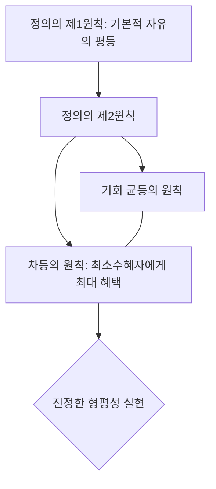

import Callout from "@/components/mdx/Callout.astro";

# Chapter 3. 행정의 혼(魂): 행정 가치와 공직 윤리의 철학

학우 여러분, 반갑습니다. 우리는 지난 시간 행정이 시대에 따라 어떤 옷을 입어왔는지 보았습니다. 오늘은 그 옷 안에 흐르는 뜨거운 피, 즉 **행정 가치(Administrative Values)와 윤리**에 대해 배워보겠습니다.

현대 행정학의 대부 드와이트 왈도는 "행정은 가치 중립적인 기술이 아니라, 민주주의의 가치를 실현하는 도구"라고 강조했습니다. 행정가는 단순히 효율적으로 일하는 기계가 아닙니다. "누가 더 고통받고 있는가?", "이 결정이 사회 전체에 공평한가?"라는 질문을 끊임없이 던지는 <mark><strong>"윤리적 의사결정자"</strong></mark>입니다. 우리 사회의 정의를 지탱하는 행정의 철학적 뿌리를 함께 찾아가 봅시다.

---

## 1. 무엇이 옳은 길인가: 본질적 가치

본질적 가치는 행정 그 자체가 도달해야 할 궁극적인 목적지입니다.

### (1) 공익 (Public Interest): 누구의 이익인가?

공익은 행정의 존재 이유입니다. 하지만 그 정의는 학자마다 다릅니다.

- **과정설**: "공익은 사익들의 합리적인 타협 결과다." 절차의 투명성과 참여를 강조합니다.
- **실체설**: "공익은 사익을 넘어선 고유한 도덕적 실체가 있다." 소수의 이익보다 전체의 선을 강조합니다.

### (2) 정의 (Justice)와 형평성

1960년대 사회적 불평등이 심화되자, 행정학은 '사회적 형평성'을 최우선 가치로 내걸었습니다. 단순히 똑같이 나누는 것이 아니라, <mark><strong>"약자에게 더 따뜻한 관심을 기울이는 것"</strong></mark>이 진정한 정의라는 깨달음이었죠.

---

## 2. 어떻게 도달할 것인가: 수단적 가치

본질적 가치를 이루기 위한 구체적인 방법론들입니다.

### 📊 행정 가치의 층위와 상호작용

| 가치 이름  | 핵심 질문                    | 시대적 배경               |
| :--------- | :--------------------------- | :------------------------ |
| **합법성** | 법에 정해진 대로 했는가?     | 근대 법치행정 (기본)      |
| **능률성** | 최소 비용으로 최대 산출인가? | 고전적 행정 (절약 강조)   |
| **민주성** | 국민의 목소리를 들었는가?    | 현대 민주행정 (참여 강조) |
| **효과성** | 원래 세운 목표를 달성했는가? | 발전행정 (결과 강조)      |

<Callout type="tip">
  **사회적 능률성**: 단순히 숫자를 아끼는 '기계적 능률성'을 넘어, 구성원의 인간적 만족과 민주적
  가치까지 포함한 것이 사회적 능률성입니다. <mark><strong>"사람을 기계로 보지 않는 효율성"</strong></mark>이 현대 행정의
  지향점입니다.
</Callout>

---

## 3. 롤즈(John Rawls)의 정의론: 공정함의 기준

현대 행정 가치의 가장 강력한 지탱목은 존 롤즈의 정의론입니다.

### 🔄 정의로운 사회를 위한 원칙

<Callout type="important">
  **차등의 원칙**: 사회적·경제적 불평등은 <mark><strong>"가장 형편이 어려운 사람(최소수혜자)"</strong></mark>에게 이익이
  돌아갈 때만 정당화될 수 있다는 원칙입니다. 이것이 바로 우리가 누진세를 내고 사회복지 제도를
  운영하는 가장 강력한 철학적 근거입니다.
</Callout>

---

## 4. 행정 윤리: 공직자의 마음가짐

아무리 좋은 가치와 시스템이 있어도 이를 운영하는 공무원의 윤리가 무너지면 행정은 부패의 온상이 됩니다.

- **외재적 책임**: 감사원, 국회, 법원 등 외부 기관이 감시하는 책임.
- **내재적 책임**: 공무원 스스로의 양심과 전문 직업 정신에 따른 책임. (헤르만 파이너 vs 칼 프리드리히의 논쟁)

현대 행정에서는 외부의 감시 못지않게 공직자 한 사람 한 사람의 <mark><strong>"공공 봉사 동기(PSM)"</strong></mark>를 일깨우는 것이 더욱 중요해지고 있습니다.

---

## 5. 결론: 가치가 바로 행정의 힘입니다

오늘 우리는 행정이 추구해야 할 수많은 가치와 그 이면의 철학을 배웠습니다. 가치는 눈에 보이지 않지만, 예산을 편성하고 정책을 결정할 때 가장 확실한 기준이 됩니다.

<mark><strong>"가치 없는 행정은 영혼 없는 육체와 같습니다."</strong></mark> 여러분이 훗날 어떤 자리에 있든, 효율성이라는 이름 아래 정의와 형평성이라는 본질적 가치를 잊지 않는 깨어있는 시민이자 전문가가 되길 바랍니다.

---

## 📖 참고문헌
행정의 가치와 윤리적 고찰을 위해 엄선한 도서입니다.

- **[정의론 (A Theory of Justice)] - 존 롤즈**: 현대 정치철학의 금자탑입니다. '무지의 베일'을 통해 우리가 어떤 사회를 갈망해야 하는지 논리적으로 증명합니다.
- **[한 명의 아이도 포기하지 않는다] - 다이앤 래비치**: 교육 행정의 사례를 통해 효율성과 성과 지상주의가 어떻게 공적 가치를 훼손할 수 있는지 경고합니다.
- **[공직 윤리론] - 데이비드 로젠블룸**: 공무원이 마주하는 복잡한 윤리적 딜레마 상황에서 어떤 판단 기준을 가져야 하는지 실무적으로 가이드합니다.

---

수고하셨습니다. 다음 시간은 사회 문제를 해결하기 위한 구체적인 수술대, **정책학: 의사결정의 과학과 가치 판단의 충돌**에 대해 본격적으로 학습해 보겠습니다.
