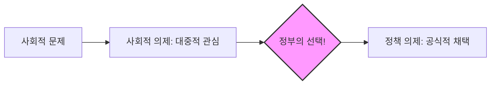

import Callout from "@/components/mdx/Callout.astro";

# Chapter 4. 사회적 수술대: 정책학 기초와 정책의 다양한 얼굴

학우 여러분, 반갑습니다. 지난 시간 우리는 행정의 가치와 윤리를 배웠습니다. 오늘은 그 가치를 실현하기 위한 구체적인 수단이자, 사회의 아픈 곳을 도려내고 치유하는 처방전인 **정책(Public Policy)**에 대해 본격적으로 학습하겠습니다.

정책학을 공부한다는 것은 우리 사회의 부와 권력이 어떤 규칙에 따라 배분되는지를 이해하는 것입니다. "새로운 도로를 놓는 것(분배)"과 "대기업의 독점을 막는 것(규제)"은 과학적 접근부터 정치적 갈등의 강도까지 완전히 다릅니다. 정책의 다양한 유형과 성격을 통해, 정부가 세상을 어떻게 바꾸려 하는지 그 전략적 의도를 읽어봅시다.

---

## 1. 정책의 본질: 무엇이 정책을 만드는가?

정책은 단순히 '좋은 생각'이 아닙니다. 그것은 정부가 공인한 <mark><strong>"공식적인 행동 방침"</strong></mark>입니다.

- **정책 목표**: 우리가 도달하려는 이상적인 상태.
- **정책 수단**: 목표를 이루기 위한 도구 (보조금, 세금, 법적 규제 등).
- **정책 대상**: 정책의 혜택을 받거나 비용을 치러야 하는 사람들.

---

## 2. 정책에 따라 정치가 변한다: 로위(Lowi)의 분류

시카고 대학의 시어도어 로위 교수는 정책의 성격에 따라 사람들이 싸우는 방식이 달라진다고 보았습니다.

### 📊 로위의 4대 정책 유형 분석

| 정책 유형       | 정의                     | 정치적 특징                         | 주요 사례                   |
| :-------------- | :----------------------- | :---------------------------------- | :-------------------------- |
| **분배 정책**   | 특정 집단에 혜택 배분    | <mark>로그롤링(나눠먹기)</mark>, 포크배럴    | 국공립 도서관, 도로 건설    |
| **규제 정책**   | 행동이나 자유를 제한     | 승자와 패자가 명확하여 갈등 심화    | 환경 규제, 공정거래법       |
| **재분배 정책** | 부의 이전 (Rich to Poor) | **계급 간의 정면충돌**, 하향적 성격 | 누진세, 영세민 구호         |
| **구성 정책**   | 게임의 규칙(조직) 설정   | 대외적 가치보다 내부 구조 중심      | 선거구 획정, 정부 조직 개편 |

<Callout type="note">
  **로그롤링(Log-rolling)**: "네가 내 지역구 다리 놓는 데 찬성하면, 나도 네 지역구 박물관 짓는 데
  찬성할게." 서로 돕는 것처럼 보이지만 결국 국민의 세금을 나눠 먹는 비효율을 낳기도 합니다.
</Callout>

---

## 3. 정책의 시작: 의제 설정 (Agenda Setting)

세상엔 수많은 문제가 있지만, 정부가 모두 해결할 순 없습니다. 이 중 '정부의 공식적인 숙제'로 채택되는 과정을 의제 설정이라고 합니다.

### 🔄 정책 의제의 승격 과정

- **외부주도형**: 시민들이 시위하고 청원해서 정부가 마지못해 받아들이는 경우. (민주적인 사회)
- **동원형**: 정부가 "이건 우리가 꼭 해결해야 해!"라고 정하고 국민을 설득하는 경우. (경제 개발기)
- **무의사결정(Non-Decision Making)**: 기득권층이 자신들에게 불리한 문제가 아예 논의조차 안 되게 막아버리는 현상입니다. <mark><strong>"침묵하게 만드는 것이 가장 강력한 권력"</strong></mark>임을 보여줍니다.

---

## 4. 정책의 수단: 당근과 채칙

정부는 목표를 위해 무엇을 쓸까요?

- **권고와 설득**: "왠지 지키고 싶게 만드는" 부드러운 개입.
- **경제적 인센티브**: 보조금(당근)이나 세금(채찍)을 통해 행동을 유도합니다.
- **직접적 규제**: 위반 시 처벌하는 가장 강력한 무기입니다.

---

## 5. 결론: 정책은 세상과 소통하는 언어입니다

오늘 우리는 정책학의 기초와 그 다양한 유형들을 보았습니다. 정책은 단순히 문자로 된 문서가 아니라, <mark><strong>"사회의 희소한 자원을 누가 더 가져갈 것인가"</strong></mark>를 정하는 거대한 의사결정 체계입니다.

여러분이 뉴스를 볼 때 "아, 저건 로위가 말한 재분배 정책이구나. 그래서 저렇게 치열하게 싸우는구나"라고 연관 지어 보십시오. 정책의 유형을 아는 순간, 복잡한 사회 갈등의 이면이 아주 선명하게 보이기 시작할 것입니다.

---

## 📖 참고문헌
정책의 형성과 집행의 메커니즘을 통찰하게 하는 도서입니다.

- **[아젠다 (Agendas, Alternatives, and Public Policies)] - 존 킹던**: 정책 결정이 어떻게 우연과 필연의 조합으로 이루어지는지, '정책의 창(Policy Window)' 이론을 통해 설명합니다.
- **[유혹하는 정책 (The Art of Policy Analysis)] - 가이 피터스**: 따분한 수식보다 이야기와 비유를 통해 정책을 대중에게 설득하는 기술에 대해 탐구합니다.
- **[권력과 정책 (Power and Policy)] - 스티븐 루크스**: 권력의 세 가지 차원을 분석하며, 보이지 않는 권력이 어떻게 정책 의제 자체를 차단하는지 폭로합니다.

---

수고하셨습니다. 다음 시간은 정책이 실제 현장에서 어떻게 구현되고, 그 효과를 어떻게 검증하는지 다루는 **정책 집행과 평가: 현장의 목소리와 수치화된 성과**에 대해 본격적으로 학습해 보겠습니다.
