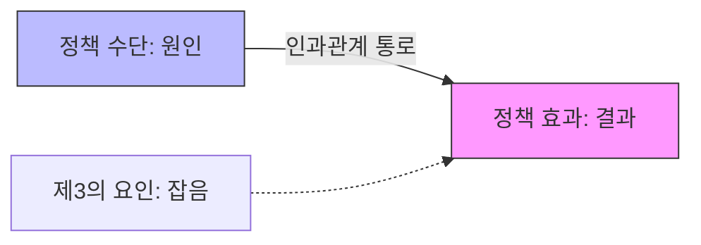

import Callout from "@/components/mdx/Callout.astro";

# Chapter 6. 현장의 울림: 정책 집행의 역동성과 성과의 거울

학우 여러분, 행정학 대장정의 마지막 장에 오신 것을 환영합니다. 우리는 지금까지 행정이 무엇인지 배우고, 가치를 논하며, 복잡한 정책을 결정해 왔습니다. 오늘은 그 모든 화려한 결정들이 실제로 시민의 삶에 닿는 '마지막 1마일', 바로 **정책 집행(Implementation)**과 **평가(Evaluation)**를 다루겠습니다.

전쟁 영웅 클라우제비츠는 "전쟁에서 모든 것은 매우 단순하지만, 가장 단순한 것이 매우 어렵다"고 했습니다. 정책도 마찬가지입니다. 책상 위에서는 완벽해 보이던 정책이 왜 현장에만 가면 삐걱거릴까요? 집행의 현장에서 벌어지는 생생한 역동성과, 그 결과를 냉철하게 되돌아보는 평가의 지혜를 함께 배워봅시다.

---

## 1. 정책 집행: 이론과 현장의 줄다리기

정책 집행은 단순히 결정을 실행하는 '배달' 과정이 아닙니다. 그것은 끊임없는 재해석과 갈등 조정의 과정입니다.

### (1) 위에서 아래로 vs 아래에서 위로

- **하향식 (Top-Down)**: "대통령의 의지가 중요하다!" 결정자의 의도와 법적 지침을 얼마나 충실히 따랐는지 봅니다. 일관성은 높지만 현장의 특수성을 무시하기 쉽습니다.
- **상향식 (Bottom-Up)**: "현장의 공무원이 진짜 정책을 만든다!" 일선 공무원들의 재량과 시민과의 상호작용을 중시합니다. 현장 적응력은 높지만 전체적인 방향을 잃을 수 있습니다.

### (2) 립스키(Lipsky)의 일선 관료제 (Street-Level Bureaucracy)

교사, 경찰, 사회복지사처럼 국민과 직접 몸을 맞대고 일하는 분들을 '일선 관료'라고 합니다. 이들은 늘 자원은 부족하고 업무는 밀려드는 한계 상황 속에서도, <mark><strong>"실질적인 재량권"</strong></mark>을 발휘하여 정책을 자신의 방식대로 구현해냅니다. 사실상 이들이 정책의 최종 제작자인 셈입니다.

---

## 2. 정책 평가: 무엇이 성공한 정책인가?

평가는 단순히 점수를 매기는 것이 아니라, 다음 정책을 위한 <mark><strong>"학습의 과정"</strong></mark>입니다.

### 📊 정책 평가의 유형별 목적

| 평가 유형       | 실시 시점     | 주요 목적                                       |
| :-------------- | :------------ | :---------------------------------------------- |
| **사전 분석**   | 결정 전       | 여러 대안 중 가장 나은 것 찾기 (비용-편익 분석) |
| **형성적 평가** | **집행 도중** | 잘못된 방향을 즉시 수정하고 개선하기            |
| **총괄적 평가** | 집행 완료 후  | 당초 목표를 달성했는지, 효과가 있었는지 확인    |

### 🔄 정책 평가의 인과관계 확인 (타당성)

<Callout type="important">
  **내적 타당성**: 정책 결과가 다른 요인(C) 때문이 아니라 오직 우리가 만든 정책(A) 때문에 나타난
  것임을 확신할 수 있는 정도입니다. 평가의 과학적 신뢰를 결정짓는 핵심 지표입니다.
</Callout>

---

## 3. 환류(Feedback): 실패는 성공의 어머니

평가 결과는 다시 정책 과정으로 환류되어야 합니다.

- **정책 승계**: 목표는 맞지만 방법이 틀렸을 때 수단을 갈아 끼우는 것.
- **정책 종결**: 더 이상 필요 없거나 해악이 클 때 과감히 마침표를 찍는 것.
  <mark><strong>"박수 칠 때 떠나거나, 흉터를 보며 고치는 것"</strong></mark> 모두가 행정의 발전 과정입니다.

---

## 4. 결론: 행정의 진정성은 결과로 말합니다

오늘 우리는 정책이 현장에서 어떻게 싹을 틔우고, 어떻게 열매를 맺는지 보았습니다. 행정학 공부를 마무리하며 잊지 말아야 할 것은, 화려한 이론보다 더 중요한 것은 <mark><strong>"현장 시민들의 삶이 어제보다 조금이라도 더 나아졌는가"</strong></mark>라는 결과에 대한 책임감입니다.

행정은 끝이 없는 과정입니다. 하나의 정책이 끝나면 평가를 통해 새로운 의제가 태어납니다. 여러분이 이 거대한 순환 속에서 세상을 더 공정하고 효율적으로 만드는 지혜로운 주역이 되시길 진심으로 응원합니다.

---

## 📚 Prof. Sean's Selected Library

정책의 집행과 성과 관리에 대한 깊은 통찰을 제공하는 명저들입니다.

- **[집행의 과학 (Implementation)] - 제프리 프레스먼, 아론 빌다브스키**: 왜 완벽해 보이는 정책이 현장에서 실패하는지, 집행의 '복잡성'을 통해 날카롭게 분석한 고전입니다.
- **[일선 관료제 (Street-Level Bureaucracy)] - 마이클 립스키**: 현장 공무원들이 마주하는 딜레마와 그들이 발휘하는 재량권이 행정의 실제 모습을 어떻게 결정하는지 규명한 책입니다.
- **[정부의 사후 관리 (The Art of Evaluation)] - 레이 파슨스**: 정책 평가가 단순한 수치를 넘어 어떻게 조직의 학습과 민주적 책임성 강화로 이어지는지 안내합니다.

---

수고하셨습니다. 행정학이라는 광활한 지도의 탐험을 저와 함께 마친 여러분 모두가 우리 사회를 지탱하는 든든한 등불이 되길 바랍니다. 감사합니다!
