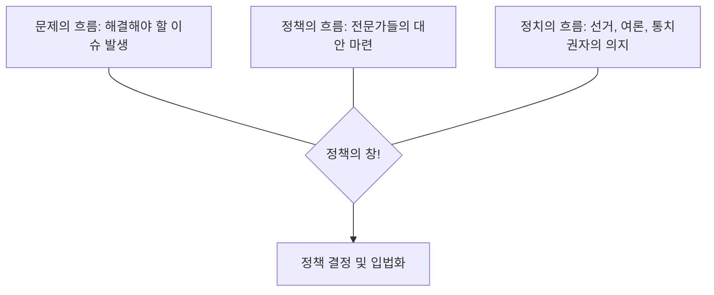

--- 
chapter: 5
title: "결정의 알고리즘: 정책 결정 모형과 합리성의 한계"
language: "ko"
summary: "정부가 복잡한 사회 문제 앞에서 어떻게 최선의 대안을 선택하는지 그 이론적 메커니즘을 분석합니다. 완전한 합리성을 꿈꾸는 합리 모형부터, 현실적 타협의 점증 모형, 그리고 우연의 미학을 다루는 쓰레기통 모형까지 다양한 의사결정의 지도를 그려봅니다."
keyTerms:
  [
    "제한된 합리성",
    "만족 모형",
    "점증 모형",
    "최적 모형",
    "쓰레기통 모형",
    "정책의 창(Policy Window)",
  ]
---

import Callout from "@/components/mdx/Callout.astro";

# Chapter 5. 결정의 알고리즘: 정책 결정 모형과 합리성의 한계

학우 여러분, 반갑습니다. 지난 시간 우리는 정책이라는 처방전의 종류를 배웠습니다. 오늘은 그 처방전을 쓰는 과정, 즉 **정책 결정(Policy Making)**의 심장부로 들어가 보겠습니다.

국가의 명운을 가르는 순간, 위정자들은 어떻게 결정을 내릴까요? 모든 정보를 검토하여 완벽한 정답을 찾아낼까요, 아니면 적당히 타협할까요? 행정학은 인간의 두뇌와 조직의 구조가 가진 <mark><strong>"합리성의 한계"</strong></mark>를 인정하는 데에서 시작합니다. 현실의 정치가들이 어떤 논리로 세상을 움직이는지, 그 결정의 알고리즘을 함께 파헤쳐 봅시다.

---

## 1. 인간을 어떻게 보는가: 개인적 차원의 모형

정책 결정은 결국 사람이 하는 일입니다. 그 사람의 지적 능력을 어떻게 보느냐에 따라 모형이 갈립니다.

### (1) 합리 모형 (Rational Model): 이상적 경제인

"인간은 신처럼 모든 것을 알 수 있다." 모든 대안의 비용과 편익을 계산하여 **최적(Optimization)**의 답을 찾는다고 가정합니다. 하지만 현실에선 정보도 시간도 늘 부족하죠.

### (2) 만족 모형 (Satisficing Model): 현실적 행정인

노벨상 수상자 허버트 사이먼(Simon)이 제안했습니다. 인간의 합리성은 제한되어 있으므로, 완벽한 최선 대신 <mark><strong>"이 정도면 됐어"</strong></mark>라고 만족할 만한 대안을 고른다는 것입니다.

### (3) 점증 모형 (Incremental Model): 타협하는 정치인

"어제 한 것에서 조금만 바꾸자." 급격한 변화는 갈등을 낳으니 기존 정책에 숟가락 하나 얹는 식으로 조금씩 나아가는 정치적 현실주의입니다. 보수적이지만 사회적 합의를 끌어내는 데 탁월합니다.

---

## 2. 복잡한 조직의 결정: 집단적 차원의 모형

조직은 여러 개인의 집합이기에 더 복잡한 역학 관계가 작용합니다.

### 📊 주요 집단 의사결정 모형 비교

| 모형 이름         | 핵심 논리                         | 특징                          |
| :---------------- | :-------------------------------- | :---------------------------- |
| **혼합주사 모형** | 큰 줄기는 합리로, 세부는 점증으로 | 에치오니의 중도적 접근        |
| **최적 모형**     | 데이터 + **직관과 영감**          | 드로어의 '초합리성' 강조      |
| **회사 모형**     | 조직은 갈등의 일시적 휴전 상태    | 표준운영절차(SOP)에 의존      |
| **쓰레기통 모형** | 고도의 불확실성 속의 우연         | 해결책과 문제가 운명처럼 만남 |

<Callout type="tip">
  **최적 모형의 시사점**: 데이터가 부족한 전시 상황이나 한 번도 가보지 않은 길을 갈 때, 리더의
  '직관(Intuition)'이 왜 중요한지 설명해 줍니다. 행정은 과학이기도 하지만 예술이기도 하기
  때문입니다.
</Callout>

---

## 3. 기회의 문이 열릴 때: 정책의 창 (Policy Window)

킹던(Kingdon)은 쓰레기통 모형을 발전시켜, 평소에는 따로 돌던 세 가지 흐름이 <mark><strong>"운명적으로 합쳐지는 찰나"</strong></mark>에 큰 정책이 결정된다고 보았습니다.

### 🔄 정책이 결정되는 3가지 흐름

<Callout type="important">
  **정책 기업가(Policy Entrepreneur)**: 이 창이 열리는 짧은 순간을 놓치지 않고 자신의 정책 대안을
  밀어 넣는 사람들이 있습니다. 이들의 기민함이 역사를 바꿉니다.
</Callout>

---

## 4. 결론: 결정은 책임의 또 다른 이름입니다

오늘 우리는 수많은 의사결정 모형을 배웠습니다. 어떤 모형이 항상 옳다고 할 수는 없습니다. 안정된 사회에선 점증 모형이, 국가적 위기 상황에선 최적 모형이 필요할 수도 있습니다.

<mark><strong>"완벽한 결정은 없지만, 책임 있는 결정은 있습니다."</strong></mark> 여러분이 훗날 어떤 조직의 리더가 되어 결정을 내릴 때, 자신의 합리성이 가진 한계를 겸허히 인정하면서도 최선의 정보를 모아 공동체를 위한 선택을 내리시길 바랍니다.

---

## 📚 Prof. Sean's Selected Library

의사결정의 심리와 전략을 깊이 있게 다룬 도서입니다.

- **[생각에 관한 생각 (Thinking, Fast and Slow)] - 대니얼 카너먼**: 인간의 인지적 편향과 제한된 합리성을 심리학적으로 완벽하게 파헤친 명저입니다.
- **[불확실성의 시대] - 존 케네스 갤브레이스**: 고정관념이 지배하는 세상에서 어떻게 유연한 사고로 정책의 돌파구를 찾을 것인지 거시적인 통찰을 줍니다.
- **[쓰레기통 모형의 이해] - 제임스 마치 외**: 조직이 어떻게 혼란 속에서도 질서를 찾아 결정을 내리는지, 그 역설적인 아름다움을 학문적으로 설명합니다.

---

수고하셨습니다. 다음 시간은 결정된 정책이 과연 현장에서 싹을 틔우는지 확인하는 과정, **'정책 집행과 평가: 현장의 목소리와 수치화된 성과'**에 대해 본격적으로 학습해 보겠습니다.
